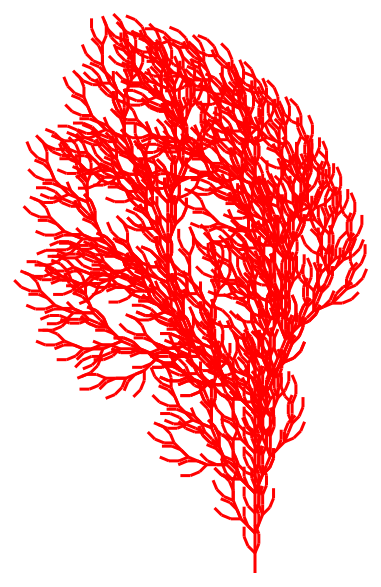
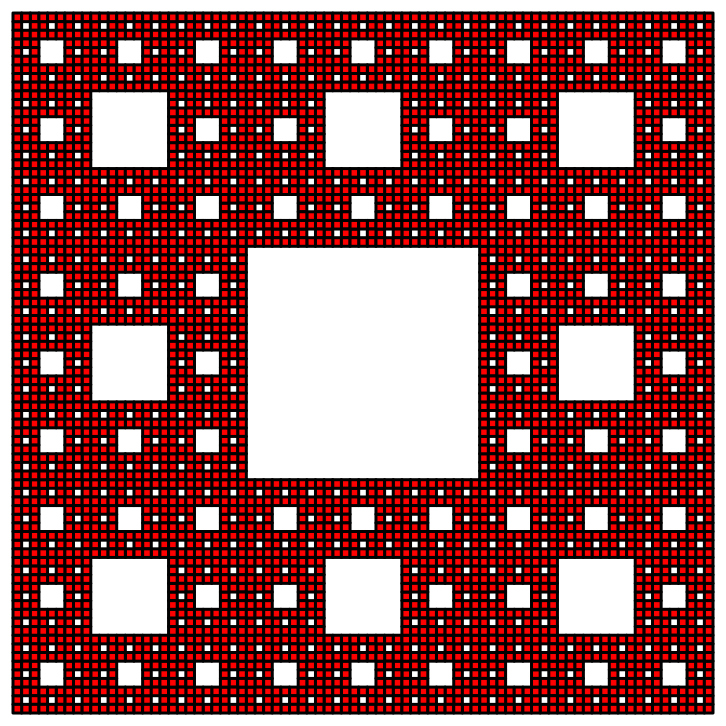

# Obsah
- [Obsah](#obsah)
- [Fractal Generator](#fractal-generator)
- [Struktura projektu](#struktura-projektu)
  - [Top-level](#top-level)
  - [Zdrojový kód](#zdrojový-kód)
- [Soubory](#soubory)
  - [Pomocné komponenty](#pomocné-komponenty)
    - [turtle.py](#turtlepy)
    - [vector.py](#vectorpy)
    - [event.py](#eventpy)
    - [stack.py](#stackpy)
  - [Fraktály](#fraktály)
    - [lsystem.py](#lsystempy)
    - [ifs.py](#ifspy)
    - [tea.py](#teapy)
- [Příklad použití a generování L-systémů](#příklad-použití-a-generování-l-systémů)
  - [Třída Turtle](#třída-turtle)
  - [Třída LSystem](#třída-lsystem)
- [Instalace](#instalace)
- [Symboly L-systémů a jejich význam](#symboly-l-systémů-a-jejich-význam)
- [Parametry](#parametry)
  - [Základní nastavení](#základní-nastavení)
  - [Juliovy množiny](#juliovy-množiny)
- [Příklady použití](#příklady-použití)
  - [Fraktální strom](#fraktální-strom)
  - [Siérpínského koberec](#siérpínského-koberec)
  - [Mandelbrotova množina](#mandelbrotova-množina)

# Fractal Generator
Pomocný program vytvořený jako součást diplomové práce s názvem **Fraktální geometrie pro (zdatné) amatéry** (odkaz [zde](https://github.com/D4vEOFF/Diploma-Thesis)).

# Struktura projektu
## Top-level
```
.
├── source                              # Zdrojový kód programu
├── .gitignore                          
├── LICENSE                             # Informace o licenci
└── README.md
```

## Zdrojový kód
```
.
├── ...
│   ├── components
│   │   ├── fractals                            # Třídy a funkce pro jednotlivé typy fraktálů
│   │   │   ├── lsystem.py                          # L-systémy
|   |   |   ├── ifs.py                              # IFS
|   |   |   ├── tea.py                              # Time Escape algoritmy
|   |   |   ├── graphics.py                         # Vykreslování obrazců
|   |   |   ├── i_iterable.py
|   |   |   └── i_transformable.py
│   │   ├── json                                # Soubory JSON definující jednotlivé fraktály
│   │   │   ├── colors                          # Interpolované barvy pro TEA fraktály
│   │   │   │   └── ...
│   │   │   ├── lsystems
│   │   │   │   └── ...
|   |   |   ├── ifs
│   │   │   │   └── ...
|   |   |   └── tea
│   │   │       └── ...
│   │   ├── event.py                            # Třída definující rozhraní pro implementaci událostí
│   │   ├── turtle.py                           # Třída pro želví grafiku
│   │   ├── stack.py                            # Třídy implementující zásobník
│   │   ├── vector.py                           # Třída pro počítání s 2D vektory
│   │   └── evaluate.py
│   └── main.py                             # Hlavní logika programu
└── ...
```

# Soubory

## Pomocné komponenty

### turtle.py
Základní logika želví grafiky. Samotné vykreslování zde však **neprobíhá**, metody a vlastnosti třídy pouze simulují pohyb pomyslné želvy. Instance třídy uchovává *aktuální pozici želvy*, její *úhel otočení* a *zda je pero spuštěno na plátně*.
- **Vlastnosti:**
  - `position` - aktuální pozice želvy uložená jako instance třídy `Vector`,
  - `step` - délka kroku při posunutí želvy,
  - `angle` - aktuální úhel natočení želvy ve stupních (interně uchováváno v radiánech),
  - `lines` - seznam vykreslených úseček uložených jako dvojice obsahující počáteční a koncový bod (vrací **kopii seznamu**, nikoliv referenci),
  - `pen_down` - určuje, zda je pero položeno na plátně,
- **Metody:**
  - `rotate(angle)` - otočí želvu o zadaný úhel (ve stupních),
  - `forward()` - posune želvu v aktuálním směru o zadanou délku kroku,
  - `clear_lines()` - vymaže všechny uchované úsečky ze seznamu,
  - `center_to(xc, yc)` - posune střed celého obrazce (tvořeného úsečkami) do pozice `(xc, yc)`,
  - `add_line_drawn_subscriber(method)` - připojí danou metodu k události `line_drawn`
  - `remove_line_drawn_subscriber(method)` - odebere danou metodu z události `line_drawn`
- **Události:**
  - `line_drawn` - vyvolána, kdykoliv je pero položeno na plátně a došlo k posunutí želvy (tj. byla nakreslena úsečka), přičemž odebírající metody obdrží jako parametry *počáteční* a *koncový* bod úsečky (jako instance třídy `Vector`)

Odkaz na soubor [zde](source/main.py).

### vector.py
Práce s vektory v rovině. Obsahuje implementaci základních vlastností a metod pro počítání (zejména pak *přetížení aritmetických operátorů*). Třída je využívána především v rámci třídy `Turtle`.
- **Vlastnosti:**
  - `x` - x-ová souřadnice vektoru,
  - `y` - y-ová souřadnice vektoru,
  - `magnitude_squared` - druhá mocnina délky vektoru (odmocnina zde není počítána pro rychlejší výpočet)
- **Operátory:**
  - `__add__` - součet dvojice vektorů (vrací vektor `(x1 + x2, y1 + y2)`),
  - `__sub__` - rozdíl dvojice vektorů (vrací vektor `(x1 - x2, y1 - y2)`),
  - `__rmul__` - násobení vektoru skalárem z prava (vrací vektor `(a * x1, a * y1)`),
  - `__mul__` - násobení vektoru skalárem z leva,
  - `__truediv__` - dělení vektoru skalárem (vrací vektor `(x1 / a, y1 / a)` pro `a` nenulové)
  - `__raise_instance_error` - vyvolá výjimku v případě chybné třídy, jejíž je operand instancí

### event.py
Implementuje rozhraní pro práci s událostmi v rámci ostatních tříd.
- **Operátory:**
  - `__iadd__` - přidá novou metodu do události,
  - `__isub__` - odebere existující metodu z události,
  - `__call__` - vyvolá všechny metody odebírající událost

### stack.py
Implementuje zásobník (datovou strukturu).
- **Vlastnosti:**
  - `items` - vrátí kopii seznamu všech prvků v zásobníku,
- **Metody:**
  - `push` - vloží na vrchol zásobníku nový prvek
  - `pop` - odstraní prvek na vrcholu zásobníku a vrátí jej,
  - `__len__` - při použití funkce `len` vrátí počet prvků v zásobníku

## Fraktály

### lsystem.py
Implementuje třídu pro práci s *L-systémy*. (Více informací k L-systémům např. [zde](https://en.wikipedia.org/wiki/L-system#:~:text=An%20L%2Dsystem%20consists%20of,generated%20strings%20into%20geometric%20structures.).)
- **Vlastnosti**
  - `word` - aktuální řetězec vzniklý aplikací pravidel z počátečního symbolu (tzv. axiomu),
  - `rules` - slovník uchovávající přepisovací pravidla,
  - `total_iterations` - celkový počet již provedených iterací
- **Metody**
  - `iterate(iteration_count)` - vypočítá zadaný počet iterací L-systému z aktuálního řetězce

### ifs.py
Třída pro práci se *systémy iterovaných funkcí*. (Více informací např. [zde](https://cs.wikipedia.org/wiki/Syst%C3%A9m_iterovan%C3%BDch_funkc%C3%AD).)
- **Vlastnosti**
  - `figures` - seznam vytvořených všech útvarů (mnohoúhelníků).
- **Metody**
  - `scale(factor)` - zvětší všechny vytvořené obrazce o zadaný faktor,
  - `translate(translation_vector)` - posune všechny vytvořené obrazce o zadaný vektor,
  - `rotate(angle)` - Otočí celý obrazec o zadaný úhel okolo počátku,
  - `center_to(xc, yc)` - posune střed vytvořeného obrazce do zadané pozice,
  - `iterate(iterations)` - provede zadaný počet iterací.

### tea.py
Třída pro práci s fraktály vnikající pomocí Time Escape algoritmu. (Více informací např. [zde](https://en.wikipedia.org/wiki/Plotting_algorithms_for_the_Mandelbrot_set).)
- **Vlastnosti**
  - `total_iterations` - celkový počet provedených iterací,
  - `point_iteration_counts` - seznam počtů iterací pro každý bod, než absolutní hodnota členu posloupnosti iterací překročila zadanou mez.
- **Metody**
  - `iterate(iterations)` - provede zadaný počet iterací.

# Příklad použití a generování L-systémů

## Třída Turtle
```python
# Nová instance třídy Turtle
turtle = Turtle(
    position=Vector(0, 0),                                  # Želva stojí v počátku
    step=20,                                                # Délka kroku (vektoru) želvy při posunutí
    angle=0                                                 # Počáteční úhel
)

turtle.pen_down = True                                      # Položí pero na plátno

turtle.add_line_drawn_subscriber(
    lambda prev_pos, new_pos: print(prev_pos, new_pos)      # Kdykoliv se želva posune na plátně a pero je dole, vypíšeme koncové body úsečky
)    

# Šestiúhelník
for _ in range(6):
    turtle.forward()                                        # Pohyb želvy vpřed
    turtle.rotate(45)                                       # Otočení o 45 stupňů
```

## Třída LSystem
```python
# Nová instance třídy LSystem
lsystem = LSystem("F", {
    "F": "F[+F]F[-F]F"                                      # Strom
})

lsystem.iterate(4)                                          # Výpočet prvních 4 iterací L-systému
print(lsystem.word)                                         # Aktuální řetězec
lsystem.iterate(3)                                          # Další 3 iterace
print(lsystem.total_iterations)                             # Celkový počet iterací provedených v L-systému (zde 7)
```

# Instalace
Je doporučeno spouštět aplikaci v rámci [virtuálního prostředí](https://wiki.python.org/moin/Virtualenv). Toho lze docílit spuštěním příkazů níže.
```
python -m venv .\source\env
.\source\Scripts\activate
```
Ve virtuálním prostředí nyní stačí doinstalovat potřebné **Python** moduly (ty lze nalézt v souboru `requirements.txt`).
```
pip install -r requirements.txt
```

# Symboly L-systémů a jejich význam

- `A`, `B`, ..., `Z` - Krok želvy vpřed s nakreslením úsečky.
- `f` - Krok želvy vpřed bez kreslení úsečky.
- `+` - Otočení želvy o definovaný úhel vpravo.
- `-` - Otočení želvy o definovaný úhel vlevo.
- `[` - Uložení aktuální pozice a úhlu želvy na vrchol zásobníku.
- `]` - Obnovení poslední uložené pozice a úhlu z vrcholu zásobníku.

# Parametry

## Základní nastavení

Program podporuje následující parametry příkazové řádky:

- `-ww`, `--window-width` - Šířka okna (výchozí: 1280)
- `-wh`, `--window-height` - Výška okna (výchozí: 720)
- `-sc`, `--stroke-color` - Barva čáry (výchozí: black)
- `-sw`, `--stroke-width` - Šířka čáry (výchozí: 3)
- `-fc`, `--fill-color` - Výplňová barva (výchozí: red)
- `-step` - Velikost kroku (výchozí: 5)
- `-scale` - Měřítko vykreslení (výchozí: 1)
- `-iter`, --iteration-count: Počet iterací (výchozí: None)
- `-angle`, `--start-angle` - Počáteční úhel (výchozí: 0)
- `-prompt` - Režim interaktivního zadávání (příznak)
- `-path` - Cesta k JSON definici fraktálu
- `-svg-path` - Cesta pro uložení SVG výstupu

## Juliovy množiny

- `--no-colors` - Vypnutí barevného rozlišení iterací (černobílý režim)
- `--draw-boundary` - Kreslení pouze hranice TEA fraktálu (Julia set)
- `--hue-min` - Minimální hodnota odstínu pro interpolaci (výchozí: 0)
- `--hue-max` - Maximální hodnota odstínu pro interpolaci (výchozí: 0.87)
- `--sat-min` - Minimální sytost pro interpolaci (výchozí: 1)
- `--sat-max` - Maximální sytost pro interpolaci (výchozí: 1)
- `--val-min` - Minimální jas pro interpolaci (výchozí: 1)
- `--val-max` - Maximální jas pro interpolaci (výchozí: 1)
- `--colors-file` - Cesta k JSON s definicemi barev (výchozí: `".\components\json\colors\basic.json"`)

# Příklady použití

## Fraktální strom

```
python .\main.py -path .\components\json\lsystems\bracketed_ol_2.json -iter 4 -angle -90 -step 10 -sc red
```



## Siérpínského koberec

```
python .\main.py -path .\components\json\ifs\sierpinsky_carpet.json -iter 4 -scale 700
```

Červená je nastavena jako výchozí barva. Lze změnit pomocí parametru `-fc`.



## Mandelbrotova množina

```
python .\main.py -path .\components\json\tea\mandelbrot_set.json -ww 800 -wh 600 -iter 100 -step 1
```

Využity základní barvy v souboru `basic.json`.

